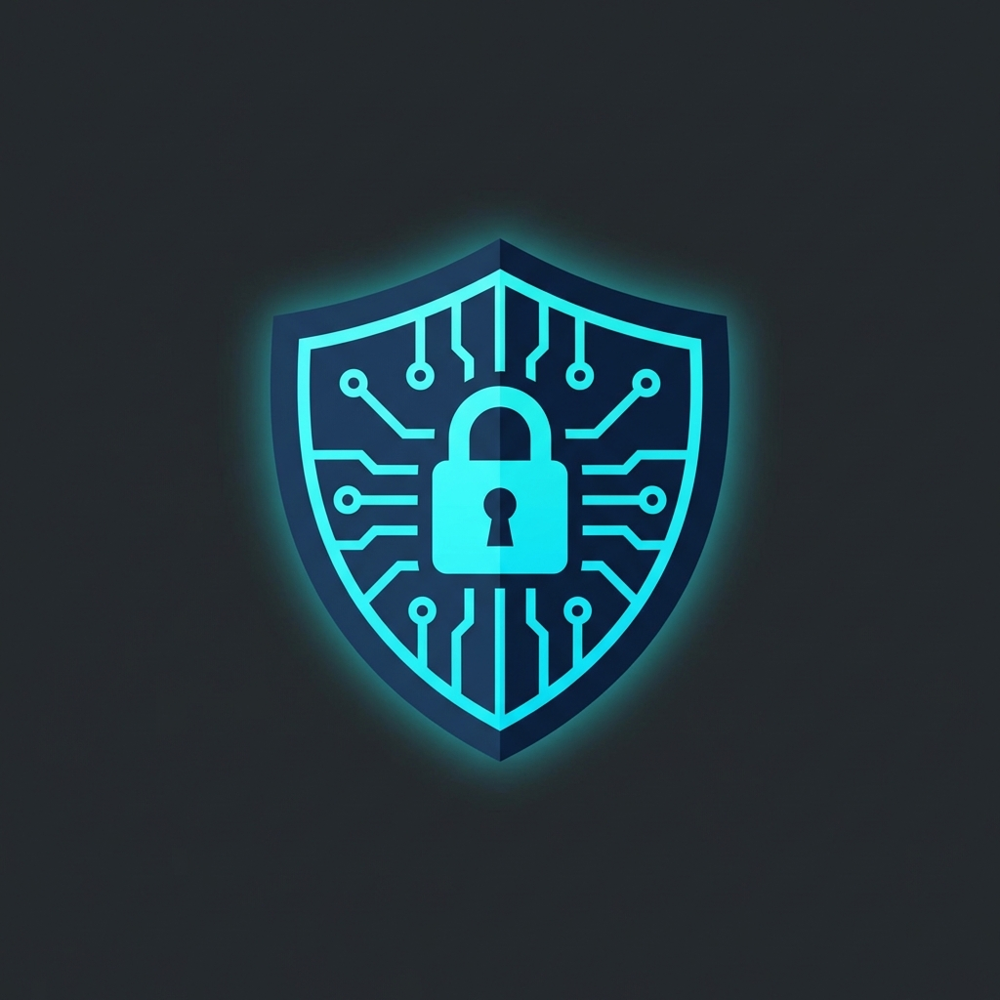

<div align="center">

# 🛡️ Arishadvarga Guardian

### **AI-Powered Cybersecurity Incident Response Platform**

[](LICENSE)
[](https://github.com/krishnakoushik9)
[](https://github.com/krishnakoushik9)
[]()
[]()
[](https://ai.google.dev/)
[](https://nextjs.org/)
[](https://www.electronjs.org/)

---



**A comprehensive, AI-assisted cybersecurity incident response and threat hunting platform designed for security professionals, college IT administrators, and SOC teams.**

> ⚠️ **IMPORTANT NOTICE**: This project is the **exclusive intellectual property of [@krishnakoushik9](https://github.com/krishnakoushik9)**. This repository cannot be claimed, forked for redistribution, or represented by any other individual or organization. All rights reserved.

</div>

---

## 📋 Table of Contents

- [Features Overview](#-features-overview)
- [Screens & Modules](#-screens--modules)
- [AI-Powered Features](#-ai-powered-features)
- [Security & Hacking Tools](#-security--hacking-tools)
- [Technology Stack](#-technology-stack)
- [Installation](#-installation)
- [Configuration](#-configuration)
- [Usage](#-usage)
- [Project Structure](#-project-structure)
- [Security Notice](#-security-notice)
- [Ownership & License](#-ownership--license)

---

## 🌟 Features Overview

| Category | Features |
|----------|----------|
| **Real-Time Monitoring** | Live system health, CPU/Memory tracking, Active Sessions, Network connections |
| **Threat Detection** | Active threat alerts, Suspicious session detection, Compromised account tracking |
| **AI Analysis** | Gemini-powered log analysis, Threat attribution, Phishing detection |
| **Incident Response** | Forensic timeline, Evidence collection, PDF/ZIP export, CERT-In reports |
| **Offensive Security** | 30+ integrated security tools, Government ID-verified access |
| **Deception Technology** | Honeypots, SSH/Web traps, Attacker tracking |
| **Containment** | Network isolation, Account lockdown, Service management |
| **Cross-Platform** | Windows & Linux desktop apps via Electron |

---

## 🖥️ Screens & Modules

### 1. 🎯 **Dashboard (Cyber Defense Command Center)**
> Real-time threat monitoring and incident response headquarters

- **Live Stats**: Active Threats, Blocked Attacks, Suspicious Sessions, Compromised Accounts
- **Recent Alerts**: Critical/Warning alerts with source IP and timestamp
- **Active Sessions**: User sessions with RDP/SSH/Terminal type tracking
- **System Health**: Real-time CPU, Memory, Disk I/O, Network monitoring
- **Quick Actions**: Lock Accounts, Block IPs, Start Forensic Scan, Isolate Server
- **Network Activity Map**: Visual network topology with threat indicators
- **Security Terminal**: One-click terminal launch for deep investigation

---

### 2. 🖧 **Control Room**
> Live network visualization and process management

- **D3.js Network Graph**: Interactive force-directed graph showing:
  - System nodes (processes, connections, IPs)
  - Threat detection with color-coded risk levels (Green/Yellow/Red)
  - Click-to-inspect node details with IP enrichment
- **Process Monitor**: 
  - Real-time process listing with PID, CPU, Memory
  - Kill suspicious processes directly
  - View process details and connections
- **Connection Tracking**: Active network connections with protocol info
- **Auto-refresh**: Configurable real-time data updates

---

### 3. 🦠 **Malware Analysis Lab**
> ClamAV-integrated malware detection and analysis

- **ClamAV Integration**: Automatic detection of ClamAV installation
- **Real-time Scanning**: Scan files, directories, or full system
- **MITRE ATT&CK Mapping**: Each detection mapped to MITRE techniques
- **Threat Intelligence**:
  - Malware family identification
  - Severity assessment (Critical/High/Medium/Low)
  - File path and hash extraction
- **AI-Powered Explanation**: Get plain-English explanation of detected malware
- **Quarantine Actions**: Isolate or remove malicious files

---

### 4. 🔍 **Digital Forensics**
> Evidence collection and incident timeline analysis

- **Attack Timeline**: Chronological event reconstruction
  - Data exfiltration detection
  - Credential dumping attempts
  - Web shell uploads
  - RDP/SSH compromise tracking
- **Evidence Collection**:
  - Web shells, malware samples, scripts
  - Hash values (SHA256) for integrity
  - File size and collection status
- **Export Options**:
  - **PDF Report**: Comprehensive incident report
  - **ZIP Archive**: All evidence bundled with timeline
- **Recommended Actions**: Prioritized remediation steps
- **CERT-In Compliance**: Reports formatted for Indian CERT guidelines

---

### 5. 🍯 **Deception Technology**
> Honeypots and traps for attacker detection

- **Trap Types**:
  - **Web Honeypot**: Fake login page on configurable port
  - **SSH Trap**: Decoy SSH server capturing credentials
  - **Database Trap**: Fake database server
- **Trap Management**:
  - Create/Delete traps dynamically
  - Real-time status monitoring (Active/Inactive/Error)
  - Port and PID tracking
- **Attack Logging**:
  - Captured credentials
  - Source IP addresses
  - Timestamp of attempts
  - Attack patterns analysis
- **Pre-configured Traps**: Ready-to-deploy trap scripts in `/public/traps/`

---

### 6. 🎣 **Social Engineering Defense**
> GenAI-powered phishing and social engineering detection

- **Email Analyzer**: 
  - Paste any email content for analysis
  - AI-powered detection of phishing patterns
- **Analysis Results**:
  - **AI Probability Score**: 0-100% likelihood of AI generation
  - **Verdict**: Phishing / Suspicious / Legitimate
  - **Indicators**:
    - Typosquatting domains
    - Urgency language patterns
    - LLM-generated text detection
    - SPF/DKIM validation
- **GenAI Detection**: Identify ChatGPT/Gemini-generated phishing content

---

### 7. 🧰 **Security Tools Arsenal**
> 30+ integrated offensive and defensive security tools

#### Tool Categories:

| Category | Tools |
|----------|-------|
| **Network & Reconnaissance** | Nmap, Masscan, Netcat, Whois, DNSRecon |
| **Vulnerability Assessment** | Nikto, OpenVAS, SQLMap, WPScan, Nuclei |
| **Exploitation** | Metasploit, Hydra, John the Ripper, Hashcat |
| **Web Security** | Burp Suite, OWASP ZAP, Gobuster, Sublist3r |
| **Forensics** | Volatility, Autopsy, Sleuth Kit, YARA |
| **Wireless** | Aircrack-ng, Reaver, Wifite |
| **System Tools** | Wireshark, Tcpdump, ClamAV, Snort |

#### Security Features:
- **Government ID Verification**: Offensive tools require webcam ID verification
- **Security Quiz**: Knowledge verification before tool access
- **Tool Installation**: One-click install missing tools
- **AI Output Analysis**: Gemini-powered analysis of tool outputs
- **Documentation Links**: Quick access to official tool docs

---

### 8. 🔒 **Containment Center**
> Incident response actions and containment controls

- **Available Actions**:
  | Action | Risk Level | Reversible |
  |--------|------------|------------|
  | Force Logout All Users | High | ✅ |
  | Block External Network Access | High | ✅ |
  | Disable Compromised Accounts | Medium | ✅ |
  | Quarantine Affected Servers | High | ✅ |
  | Reset All Active Sessions | Medium | ❌ |
  | Enable Emergency Firewall Rules | Medium | ✅ |

- **Execution Tracking**: 
  - Status indicators (Available/Active/Executed)
  - Timestamp logging
  - Revert capabilities
- **Confirmation Dialogs**: Critical action confirmation
- **Audit Trail**: All actions logged with timestamps

---

### 9. 🎯 **Threat Attribution**
> Identify and profile threat actors

- **Threat Actor Profile**:
  - Actor type (Nation-State, eCrime, Hacktivist)
  - Known group associations (APT groups, SCATTERED SPIDER, etc.)
  - Skill level assessment (1-10)
  - Confidence rating
- **Indicators of Compromise (IOCs)**:
  - Source IP addresses with geolocation
  - Cloud provider identification
  - Tor exit node detection
- **Behavior Patterns**:
  - Initial access methods
  - Lateral movement techniques
  - C2 communication patterns
  - Data exfiltration methods
- **Gemini AI Attribution**: AI-powered threat actor profiling

---

### 10. 💬 **AI Guidance Assistant**
> Real-time AI chatbot for incident response guidance

- **Chat Interface**: Real-time conversation with AI assistant
- **Contextual Help**: 
  - Step-by-step incident response guidance
  - Action prioritization
  - Risk explanations
- **Action Recommendations**:
  - Priority-ranked response steps
  - Risk assessment per action
  - Plain-English explanations
- **Markdown Support**: Formatted responses with code blocks
- **Non-Expert Friendly**: Designed for IT admins without security expertise

---

## 🤖 AI-Powered Features

<div align="center">

| Feature | Description | Powered By |
|---------|-------------|------------|
| **Security Log Analysis** | Plain-English summary of logs with threat detection | Gemini 3 Flash |
| **Threat Actor Attribution** | Identify threat groups based on TTPs and IOCs | Gemini 3 Flash |
| **AI Phishing Detection** | Detect LLM-generated phishing with confidence scores | Gemini 3 Flash |
| **Incident Report Generation** | CERT-In style reports from incident data | Gemini 3 Flash |
| **Real-Time Guidance** | Interactive AI chatbot for incident response | Gemini 3 Flash |
| **Tool Output Analysis** | Plain-English explanation of security tool outputs | Gemini 3 Flash |
| **Malware Explanation** | MITRE ATT&CK mapping with remediation steps | Gemini 3 Flash |
| **Government ID Verification** | Vision-powered document verification for tool access | Gemini 3 Flash Vision |

</div>

### AI API Actions:
```javascript
// Available AI actions via /api/gemini
- analyzeLogs      // Security log analysis
- attributeThreat  // Threat actor attribution
- detectPhishing   // AI-generated phishing detection
- generateReport   // CERT-In style incident reports
- getGuidance      // Interactive guidance
- analyzeToolOutput// Tool output explanation
- explainMalware   // Malware behavior analysis
```

---

## 🔓 Security & Hacking Tools

### Offensive Security Features:
- **30+ Pre-configured Tools**: Network scanners, vulnerability assessors, exploitation frameworks
- **ID Verification System**: Government ID verification via Gemini Vision before accessing offensive tools
- **Security Quiz**: Knowledge verification to ensure responsible use
- **Tool Categories**:
  - 🔍 Reconnaissance
  - 🌐 OSINT
  - 🔓 Exploitation
  - 🖧 Network Analysis
  - 🔐 Password Cracking
  - 📡 Wireless Security
  - 🦠 Malware Analysis

### Defensive Security Features:
- **Honeypot Deployment**: Web, SSH, and Database traps
- **Real-time Monitoring**: System processes and network connections
- **Threat Detection**: Pattern-based and AI-powered detection
- **Evidence Collection**: Forensic-grade evidence preservation
- **Incident Containment**: Network isolation and account lockdown

---

## 🛠️ Technology Stack

<div align="center">

| Layer | Technology |
|-------|------------|
| **Frontend** | Next.js 16, React 19, TypeScript |
| **Desktop** | Electron 40 |
| **AI/ML** | Google Gemini API (gemini-3-flash-preview) |
| **Visualization** | D3.js, Recharts |
| **Icons** | Lucide React |
| **Styling** | CSS Modules |
| **PDF Generation** | jsPDF |
| **Compression** | JSZip |
| **Security** | ClamAV Integration, SSH2 |
| **Build** | electron-builder |

</div>

---

## 📦 Installation

### Prerequisites
- Node.js 18+ 
- npm or yarn
- Git
- ClamAV (optional, for malware scanning)
- Gemini API Key (for AI features)

### Quick Start

```bash
# Clone the repository
git clone https://github.com/krishnakoushik9/arishadvarga-guardian.git

# Navigate to project directory
cd arishadvarga-guardian

# Install dependencies
npm install

# Create environment file
cp .env.example .env

# Add your Gemini API key to .env
# GEMINI_API_KEY=your_api_key_here

# Run development server
npm run dev

# OR run with Electron (desktop app)
npm run electron:dev
```

### Build Desktop App

```bash
# Build for Windows and Linux
npm run dist

# Output will be in /dist folder:
# - Windows: Arishadvarga-Guardian.exe (portable)
# - Linux: Arishadvarga-Guardian.AppImage, .deb
```

---

## ⚙️ Configuration

### Environment Variables

Create a `.env` file in the project root:

```env
# Required for AI features
GEMINI_API_KEY=your_gemini_api_key

# Optional configurations
NODE_ENV=development
PORT=3000
```

### Trap Configuration

Edit trap settings in `/public/traps/`:
- `web-trap.js` - Web honeypot configuration
- `ssh-trap.js` - SSH honeypot configuration
- `host.key` - SSH host key for trap

---

## 🚀 Usage

### Running the Application

```bash
# Web Development
npm run dev           # Start Next.js dev server at http://localhost:3000

# Desktop Development
npm run electron:dev  # Start Electron app with hot reload

# Production Build
npm run build         # Build Next.js application
npm run start         # Start production server
npm run dist          # Build desktop applications
```

### Accessing Features

1. **Dashboard**: `http://localhost:3000` - Main command center
2. **Control Room**: `/control-room` - Network monitoring
3. **Malware Lab**: `/malware` - Malware analysis
4. **Forensics**: `/forensics` - Digital forensics
5. **Deception**: `/deception` - Honeypot management
6. **Social Engineering**: `/social-engineering` - Phishing detection
7. **Tools**: `/tools` - Security tools arsenal
8. **Containment**: `/containment` - Incident response
9. **Attribution**: `/attribution` - Threat actor profiling
10. **Guidance**: `/guidance` - AI assistant

---

## 📁 Project Structure

```
arishadvarga-guardian/
├── app/                          # Next.js App Router
│   ├── api/                      # API Routes
│   │   ├── chat/                 # Chat API
│   │   ├── deception/            # Honeypot API
│   │   ├── enrich-ip/            # IP enrichment API
│   │   ├── export/               # Export API
│   │   ├── gemini/               # Gemini AI API
│   │   ├── malware/              # Malware scan API
│   │   ├── system/               # System info API
│   │   └── verify-id/            # ID verification API
│   ├── attribution/              # Threat attribution page
│   ├── containment/              # Containment page
│   ├── control-room/             # Control room with network graph
│   ├── deception/                # Honeypot management page
│   ├── forensics/                # Digital forensics page
│   ├── guidance/                 # AI guidance page
│   ├── malware/                  # Malware analysis page
│   ├── social-engineering/       # Social engineering defense
│   ├── tools/                    # Security tools page
│   ├── page.tsx                  # Main dashboard
│   └── layout.tsx                # Root layout
├── components/                   # React components
│   ├── Layout/                   # Layout components
│   │   ├── MainLayout.tsx
│   │   ├── Sidebar.tsx
│   │   └── TopBar.tsx
│   └── Verification/             # ID verification component
├── contexts/                     # React contexts
│   └── SystemContext.tsx         # System state management
├── lib/                          # Utility libraries
│   └── gemini.ts                 # Gemini AI integration
├── public/                       # Static assets
│   ├── traps/                    # Honeypot scripts
│   │   ├── web-trap.js
│   │   ├── ssh-trap.js
│   │   └── host.key
│   └── icon.png                  # App icon
├── styles/                       # Global styles
├── electron/                     # Electron configuration
│   └── main.js                   # Electron main process
├── package.json                  # Dependencies and scripts
└── README.md                     # This file
```

---

## 🔐 Security Notice

> ⚠️ **IMPORTANT**: This tool contains offensive security capabilities. Use responsibly.

### Responsible Use Guidelines:
1. **Authorization Required**: Only use on systems you have explicit permission to test
2. **ID Verification**: Offensive tools require government ID verification
3. **Ethical Use**: Do not use for malicious purposes
4. **Legal Compliance**: Ensure compliance with local cybersecurity laws
5. **Data Protection**: Handle collected evidence per data protection regulations

### Built-in Safety Features:
- Government ID verification for offensive tools
- Security quiz before tool access
- Audit logging of all actions
- Confirmation dialogs for critical operations

---

## 👤 Ownership & License

<div align="center">

## ⚠️ OWNERSHIP NOTICE ⚠️

| | |
|-|-|
| **Sole Owner & Maintainer** | [@krishnakoushik9](https://github.com/krishnakoushik9) |
| **Copyright** | © 2024-2026 Krishna Koushik. All Rights Reserved. |
| **License** | Proprietary - All Rights Reserved |

---

### 🚫 This Repository:
- **CANNOT** be claimed by any individual or organization
- **CANNOT** be forked for redistribution without explicit written permission
- **CANNOT** be used commercially without licensing agreement
- **CANNOT** be represented as work of any other party

### ✅ Permitted:
- Personal educational use
- Security research (with attribution)
- Contributions via pull requests (credited, not ownership transfer)

</div>

---

<div align="center">

### Made with 🛡️ by [@krishnakoushik9](https://github.com/krishnakoushik9)

**Arishadvarga Guardian** - *Defending Against the Six Enemies*

*Arishadvarga (अरिषड्वर्ग) refers to the six internal enemies in Hindu philosophy. This platform guards against the six categories of cyber threats.*

---

[](https://github.com/krishnakoushik9)

</div>
